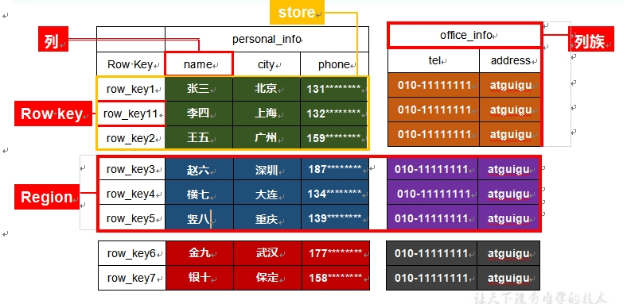
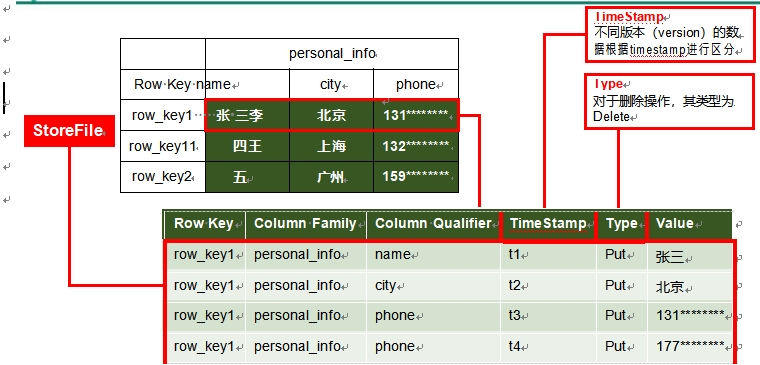
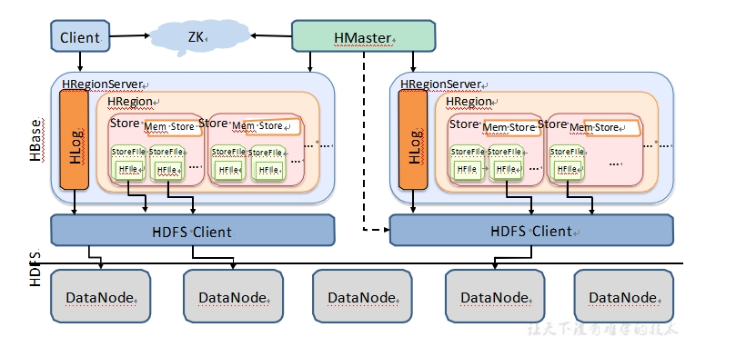
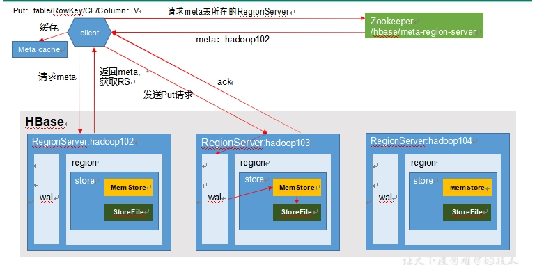
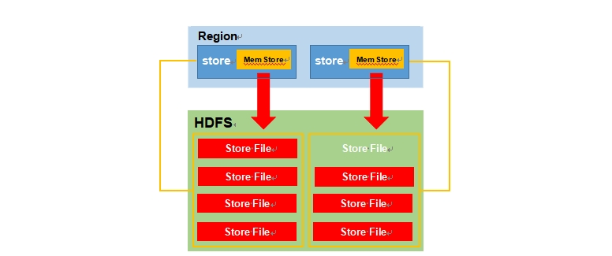
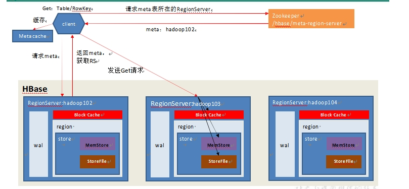
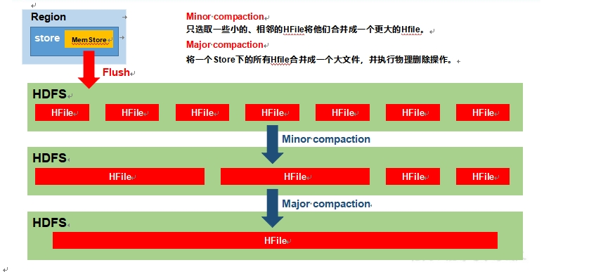
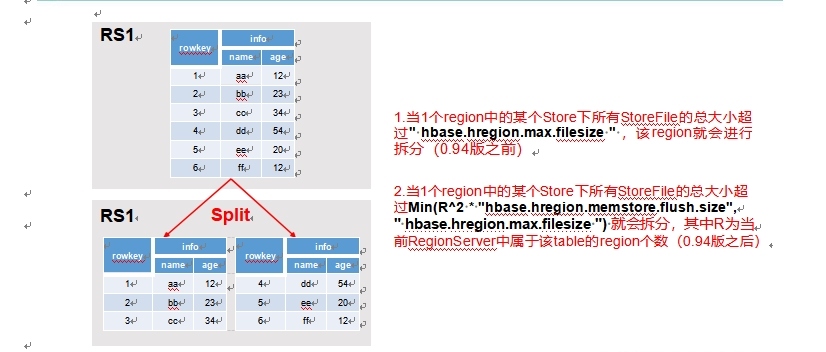

# 第 1 章 HBase 简 介

### HBase 定义

HBase 是一种分布式、可扩展、支持海量数据存储的 NoSQL 数据库。

### Hbase的优点

①HDFS有高容错，高扩展的特点，而Hbase基于HDFS实现数据的存储，因此Hbase拥有与生俱来的超强的扩展性和吞吐量。

②HBase采用的是Key/Value的存储方式，这意味着，即便面临海量数据的增长，也几乎不会导致查询性能下降。

③HBase是一个列式数据库，相对于于传统的行式数据库而言。当你的表字段很多的时候，
可以将不同的列存在到不同的服务实例上，分散负载压力。

### Hbase的缺点

①架构设计复杂，且使用HDFS作为分布式存储，因此只是存储少量数据，它也不会
很快。在大数据量时，它慢的不会很明显！

②Hbase不支持表的关联操作，因此数据分析是HBase的弱项。常见的 group by或order by只能通过编写MapReduce来实现！

③Hbase部分支持了ACID

### Hbase的总结

适合场景：单表超千万，上亿，且高并发！
　　

不适合场景：主要需求是数据分析，比如做报表。数据量规模不大，对实时性要求高！

### HBase 逻辑结构

### **HBase 物理存储结构**



### 数据模型

##### Name Space

> 命名空间，类似于关系型数据库的 DatabBase 概念，每个命名空间下有多个表。HBase 有两个自带的命名空间，分别是 hbase 和 default，hbase 中存放的是 HBase 内置的表， default 表是用户默认使用的命名空间。

##### Region

> Region由一个表的若干行组成！在Region中行的排序按照行键（rowkey）字典排序。
>
> Region不能跨服务器，且当数据量大的时候，HBase会拆分Region。
> 　　
>
> Region由RegionServer进程管理。HBase在进行负载均衡的时候，一个Region有可能会从当前RegionServer移动到其他RegionServer上。
> 　　
>
> Region是基于HDFS的，它的所有数据存取操作都是调用了HDFS的客户端接口来实现的。

##### Row

> HBase 表中的每行数据都由一个 **RowKey** 和多个 **Column**（列）组成，数据是按照 RowKey 的字典顺序存储的，并且查询数据时只能根据 RowKey 进行检索，所以 RowKey 的设计十分重要

##### Column

> HBase 中的每个列都由 Column Family(列族)和 Column Qualifier（列限定符）进行限定，例如 info：name，info：age。建表时，只需指明列族，而列限定符无需预先定义。
>

##### Time Stamp

> 用于标识数据的不同版本（version），每条数据写入时，如果不指定时间戳，系统会自动为其加上该字段，其值为写入 HBase 的时间。
>

##### Cell

> 由{rowkey, column Family：column Qualifier, time Stamp} 唯一确定的单元。cell 中的数据是没有类型的，全部是字节码形式存贮。

### HBase 基本架构



##### Region Server

Region Server 为 Region 的管理者，其实现类为 HRegionServer，主要作用如下: 对于数据的操作：get, put, delete；

对于 Region 的操作：splitRegion、compactRegion。

##### **Master**

Master 是所有 Region Server 的管理者，其实现类为 HMaster，主要作用如下：

对于表的操作：create, delete, alter

对于RegionServer 的操作：分配regions 到每个RegionServer，监控每个RegionServer的状态，负载均衡和故障转移。

##### Zookeeper

HBase 通过 Zookeeper 来做 Master 的高可用、RegionServer 的监控、元数据的入口以及集群配置的维护等工作。

##### HDFS

HDFS 为 HBase 提供最终的底层数据存储服务，同时为HBase 提供高可用的支持。

##### StoreFile

保存实际数据的物理文件，StoreFile 以 HFile 的形式存储在 HDFS 上。每个 Store 会有一个或多个 StoreFile（HFile），数据在每个 StoreFile 中都是有序的。

##### **MemStore**

写缓存，由于 HFile 中的数据要求是有序的，所以数据是先存储在 MemStore 中，排好序后，等到达刷写时机才会刷写到HFile，每次刷写都会形成一个新的HFile。

##### **WAL**

由于数据要经 MemStore 排序后才能刷写到 HFile，但把数据保存在内存中会有很高的概率导致数据丢失，为了解决这个问题，数据会先写在一个叫做 Write-Ahead logfile 的文件中，然后再写入 MemStore 中。所以在系统出现故障的时候，数据可以通过这个日志文件重建。

### Hbase写流程



1.  Client 先访问 zookeeper，获取 hbase:meta 表位于哪个Region Server。
2.  访问对应的 Region Server，获取 hbase:meta 表，根据读请求的 namespace:table/rowkey， 查询出目标数据位于哪个 Region Server 中的哪个 Region 中。并将该 table 的 region 信息以及 meta 表的位置信息缓存在客户端的 meta cache，方便下次访问。
3.  与目标Region Server 进行通讯；
4.  将数据顺序写入（追加）到 WAL；
5.  将数据写入对应的 MemStore，数据会在 MemStore 进行排序；
6.  向客户端发送ack；
7.  等达到 MemStore 的刷写时机后，将数据刷写到HFile。

### Flush



MemStore刷写时机：

1. 当某个 memstroe 的大小达到了 hbase.hregion.memstore.flush.size（默认值128M）， 其所在 region 的所有 memstore 都会刷写。

   当 memstore 的大小达到了
   hbase.hregion.memstore.flush.size（默认值 128M）x hbase.hregion.memstore.block.multiplier（默认值 4） 时，会阻止继续往该 memstore 写数据。

2. 当region server 中 memstore 的总大小达到java_heapsize x hbase.regionserver.global.memstore.size（默认值0.4）x hbase.regionserver.global.memstore.size.lower.limit（默认值0.95），region 会按照其所有 memstore 的大小顺序（由大到小）依次进行刷写。直到 region server中所有 memstore 的总大小减小到上述值以下。

   当 region server 中memstore 的总大小达到java_heapsize\*hbase.regionserver.global.memstore.size（默认值0.4）时，会阻止继续往所有的memstore 写数据。

3. 到达自动刷写的时间，也会触发 memstore flush。自动刷新的时间间隔由该属性进行配置hbase.regionserver.optionalcacheflushinterval（默认1小时）。

4. 当 WAL 文件的数量超过 hbase.regionserver.max.logs，region 会按照时间顺序依次进行刷写，直到 WAL 文件数量减小到hbase.regionserver.max.log以下（该属性名已经废弃， 现无需手动设置，最大值为 32）。

### Hbase读流程



1.  Client 先访问 zookeeper，获取 hbase:meta 表位于哪个Region Server。

2.  访问对应的 Region Server，获取 hbase:meta 表，根据读请求的 namespace:table/rowkey， 查询出目标数据位于哪个 Region Server 中的哪个 Region 中。并将该 table 的 region 信息以及 meta 表的位置信息缓存在客户端的 meta cache，方便下次访问。

3. 与目标Region Server 进行通讯；

4. 分别在Block Cache（读缓存），MemStore 和 Store File（HFile）中查询目标数据，并将查到的所有数据进行合并。此处所有数据是指同一条数据的不同版本（time stamp）或者不同的类型（Put/Delete）。

5. 将从文件中查询到的数据块（Block，HFile 数据存储单元，默认大小为 64KB）缓存到Block Cache。

6. 将合并后的最终结果返回给客户端。

### StoreFile Compaction



由于memstore 每次刷写都会生成一个新的HFile，且同一个字段的不同版本（timestamp）和不同类型（Put/Delete）有可能会分布在不同的HFile 中，因此查询时需要遍历所有的 HFile。

为了减少 HFile 的个数，以及清理掉过期和删除的数据，会进行 StoreFile Compaction。Compaction 分为两种，分别是 Minor Compaction 和 Major Compaction。Minor Compaction
会将临近的若干个较小的 HFile  合并成一个较大的 HFile，但不会清理过期和删除的数据。
Major Compaction 会将一个 Store 下的所有的 HFile 合并成一个大 HFile，并且会清理掉过期和删除的数据。

### Region Split



默认情况下，每个 Table 起初只有一个Region，随着数据的不断写入，Region 会自动进行拆分。刚拆分时，两个子 Region 都位于当前的 Region Server，但处于负载均衡的考虑， HMaster 有可能会将某个 Region 转移给其他的 Region Server。

Region Split 时机：

1. 当1 个region 中的某个Store 下所有StoreFile 的总大小超过hbase.hregion.max.filesize， 该 Region 就会进行拆分（0.94 版本之前）。

2. 当 1 个 region 中的某个 Store 下所有 StoreFile 的总大小超过 Min(R^2 * "hbase.hregion.memstore.flush.size",hbase.hregion.max.filesize")，该 Region 就会进行拆分，其中 R 为当前 Region Server 中属于该 Table 的个数（0.94 版本之后）。


# 第 2 章 HBase Shell

### 基本操作

##### 查看当前数据库中有哪些表

list

list后可以使用*等通配符来进行表的过滤！

### 表的操作

##### 创建表

```
格式：
　　create '表名', { NAME => '列族名1', 属性名 => 属性值}, {NAME => '列族名2', 属性名 => 属性值}, …
　　如果你只需要创建列族，而不需要定义列族属性，那么可以采用以下快捷写法：
　　create'表名','列族名1' ,'列族名2', …
create 'student','info'
```

##### 插入数据到表

```
put '表名', '行键', '列名', '值'
put '表名', '行键', '列名', '值',时间戳
put '表名', '行键', '列名', '值', { '属性名' => '属性值'}
put '表名', '行键', '列名', '值',时间戳, { '属性名' =>'属性值'}
hbase(main):003:0> put 'student','1001','info:sex','male' 
hbase(main):004:0> put 'student','1001','info:age','18' 
hbase(main):005:0> put 'student','1002','info:name','Janna' 
hbase(main):006:0> put 'student','1002','info:sex','female' 
hbase(main):007:0> put 'student','1002','info:age','20'
```

##### **扫描查看表数据**

```
scan命令可以按照rowkey的字典顺序来遍历指定的表的数据。
scan ‘表名’：默认当前表的所有列族。
scan ‘表名’,{COLUMNS=> [‘列族:列名’],…} ： 遍历表的指定列
scan '表名', { STARTROW => '起始行键', ENDROW => '结束行键' }：指定rowkey范围。如果不指定，则会从表的开头一直显示到表的结尾。区间为左闭右开。
scan '表名', { LIMIT => 行数量}： 指定返回的行的数量
scan '表名', {VERSIONS => 版本数}：返回cell的多个版本
scan '表名', { TIMERANGE => [最小时间戳, 最大时间戳]}：指定时间戳范围
		注意：此区间是一个左闭右开的区间，因此返回的结果包含最小时间戳的记录，但是不包含最大时间戳记录
scan '表名', { RAW => true, VERSIONS => 版本数}
	显示原始单元格记录，在Hbase中，被删掉的记录在HBase被删除掉的记录并不会立即从磁盘上清除，而是先被打上墓碑标记，然后等待下次major compaction的时候再被删除掉。注意RAW参数必须和VERSIONS一起使用，但是不能和COLUMNS参数一起使用。
scan '表名', { FILTER => "过滤器"} and|or { FILTER => "过滤器"}: 使用过滤器扫描
hbase(main):008:0> scan 'student'
hbase(main):009:0> scan 'student',{STARTROW => '1001', STOPROW	=> '1001'}
hbase(main):010:0> scan 'student',{STARTROW => '1001'}
```

##### **查看表结构**

```
describe ‘student’
```

##### 更新指定字段的数据

```
put 'student','1001','info:name','Nick' 
```

##### **查看"指定行"或"指定列族:列"的数据**

```
hbase(main):014:0> get 'student','1001' 
hbase(main):015:0> get 'student','1001','info:name'
```

##### **统计表数据行数**

```
count 'student'
```

##### 删除数据

```
删除某 rowkey 的全部数据：
hbase(main):016:0> deleteall 'student','1001'
删除某 rowkey 的某一列数据：
hbase(main):017:0> delete 'student','1002','info:sex'
```

##### 清空表数据

```
hbase(main):018:0> truncate 'student'
清空表的操作顺序为先 disable，然后再 truncate
```

##### 删除表

```
首先需要先让该表为 disable 状态：
hbase(main):019:0> disable 'student'
然后才能 drop 这个表：
hbase(main):020:0> drop 'student'
```

##### 变更表信息

```
将 info 列族中的数据存放 3 个版本：
hbase(main):022:0> alter 'student',{NAME=>'info',VERSIONS=>3} 
hbase(main):022:0> get 'student','1001',{COLUMN=>'info:name',VERSIONS=>3}
```


# 第 3 章 HBase API

```
1. Connection
      代表和hbase集群的一个连接，包含zookeeper连接。
      重量级初始化，建议一个应用只需要创建一个Connection对象。
      线程安全，可以在多个线程共享。
      手动执行close()方法，自己维护生命周期。
      创建Admin:  Connection.getAdmin(),Admin执行DDL语句。
      创建Table: Connection.getTable(),Table执行DML语句。

      Connection的创建ConnectionFactory.createConnection();

2. Admin
      Admin执行DDL语句,执行表和库的增删改查。
      Admin属于轻量级的初始化，Admin是线程不安全的，不能共享。
      可以使用ThreadLocal保证一个线程中只创建一个当前线程使用的Admin对象。

   库操作：
         建库：  Admin.createNameSpace(NameSpaceDescriptor)
         删除：  Admin.deleteteNameSpace(String 库名)
         查看所有的库：NameSpaceDescriptor[] xxx = Admin.listNameSpace()

   表操作：
         判断表是否存在：Admin.tableExists(TableName x)
         建表:  Admin.createTable(HTableDescriptor x)
         删除: Admin.deleteTable(TableName x)

3. NameSpaceDescriptor
      库的描述。库的所有属性，都需要使用当前类来设置。

4. TableName
      代表一个表的名称。
      TableName.valueof(String 表名)
      TableName.valueof(String nsname,String 表名)

5. HTableDescriptor
      代表表的描述，表的所有属性，包括列族都要在HTableDescriptor中声明。

      new HTableDescriptor(TableName x)

      在HTableDescriptor，调用addFamily(HColumnDescriptor)

6. HColumnDescriptor
      代表列族的描述，列族的属性，可以在这个对象中声明。

7. Table
      代表一个表。可以执行DML语句。线程不安全的，不能共享。每个表应该有自己的Table。

      new Table(TableName tn);

      Put:  Table.put(Put x);
           Table.put(List<Put> x);

      get： Table.get(Get x);
            Table.get(List<Get> x);

      scan : Table.getScaner(Scan scan)

      delete : Table.delete(Delete x)


8. Put:
      代表一个rowkey的value部分。多个Cell（单元格）的集合。
      Put.add(Cell cell);
      Put.addColumn(byte [] family,byte [] quliefier ,long ts ,byte [] value)

9. Get
      代表查询一行内容的参数。  rowkey+value
      get可以设置属性

   Result result= Table.get(Get x);

10. Result
      Results是一行中多个cell的集合。

11. Scan
      Scan代表多行查询的参数集合。
      Scan需要设置查询的表名，多个列族，多个列，查询的版本号...

12 . Delete
      Delete代表删除操作的参数。

      Delete可以删除某个列中具体版本的数据。新增一条type=DELETE类型的数据，而且时间戳为当前列中最大的时间戳。

9. 工具类
         Bytes:  可以将常用的数据类型和byte[]间转换
                  Bytes.toBytes(): 转为byte[]
                  Bytes.toxxx(): 转为某个类型

         CellUtils:  操作Cell，获取cell中的属性（列族，列名，值...）
               CellUtils.clonexxx(Cell x)
```

### **获取 Configuration 对象**

```java
public static Configuration conf; 
static{
    //使用 HBaseConfiguration 的单例方法实例化
    conf = HBaseConfiguration.create(); 
    conf.set("hbase.zookeeper.quorum", "192.166.9.102");
	conf.set("hbase.zookeeper.property.clientPort", "2181");
}
```


### **判断表是否存在**

```java
public	static	boolean	isTableExist(String	tableName)	throws MasterNotRunningException,ZooKeeperConnectionException, IOException{
    //在 HBase 中管理、访问表需要先创建 HBaseAdmin 对象
    connection = ConnectionFactory.createConnection(conf);
    //HBaseAdmin 
    HBaseAdmin admin = new HBaseAdmin(conf);
	return admin.tableExists(tableName);
}
```


### **创建表**

```java
public	static	void	createTable(String	tableName,	String... columnFamily) throws MasterNotRunningException,ZooKeeperConnectionException, IOException{
    HBaseAdmin admin = new HBaseAdmin(conf);
	//判断表是否存在
    if(isTableExist(tableName)){
		System.out.println("表" + tableName + "已存在");
		//System.exit(0);
	}else{
		//创建表属性对象,表名需要转字节
		HTableDescriptor descriptor = new 	
        HTableDescriptor(TableName.valueOf(tableName));
		//创建多个列族
		for(String cf : columnFamily){ 
        	descriptor.addFamily(new HColumnDescriptor(cf));
		}
		//根据对表的配置，创建表
    	admin.createTable(descriptor); 
   	 	System.out.println("表" + tableName + "创建成功！");
}
}
```


### **删除表**

```java
public static void dropTable(String tableName) throws
MasterNotRunningException, ZooKeeperConnectionException, IOException{
	HBaseAdmin admin = new HBaseAdmin(conf); 
    if(isTableExist(tableName)){
		admin.disableTable(tableName); 
        admin.deleteTable(tableName);
		System.out.println("表" + tableName + "删除成功！");
	}else{
		System.out.println("表" + tableName + "不存在！");
	}
}
```

### **向表中插入数据**

```java
public static void addRowData(String tableName,	String rowKey,String columnFamily, String column, String value) throws IOException{
	//创建 HTable 对象
	HTable hTable = new HTable(conf, tableName);
	//向表中插入数据
	Put put = new Put(Bytes.toBytes(rowKey));
	//向 Put 对象中组装数据
	put.add(Bytes.toBytes(columnFamily), Bytes.toBytes(value));
	hTable.put(put); 
    hTable.close();
	System.out.println("插入数据成功");
}
```


### **删除多行数据**

```java
public static void deleteMultiRow(String tableName, String... rows) throws IOException{
	HTable hTable = new HTable(conf, tableName); 
    List<Delete> deleteList = new ArrayList<Delete>(); 
    for(String row : rows){
		Delete delete = new Delete(Bytes.toBytes(row)); 
        deleteList.add(delete);
	}
	hTable.delete(deleteList); 
    hTable.close();
}
```


### **获取所有数据**

```java
public static void getAllRows(String tableName) throws IOException{ 
    HTable hTable = new HTable(conf, tableName);
	//得到用于扫描 region 的对象
	Scan scan = new Scan();
	//使用 HTable 得到 resultcanner 实现类的对象
	ResultScanner resultScanner = hTable.getScanner(scan); 
    for(Result result : resultScanner){
		Cell[] cells = result.rawCells(); 
        for(Cell cell : cells){
			//得到 rowkey
			System.out.println("行键:"+ 
                               Bytes.toString(CellUtil.cloneRow(cell)));
			//得到列族
			System.out.println("	列	族	"	+ 
                               Bytes.toString(CellUtil.cloneFamily(cell)));
			System.out.println("	列	:"	+ 
                               Bytes.toString(CellUtil.cloneQualifier(cell)));
			System.out.println("	值	:"	+ 
                               Bytes.toString(CellUtil.cloneValue(cell)));
}
}
}
```


### **获取某一行数据**

```java
public static void getRow(String tableName, String rowKey) throws IOException{
	HTable table = new HTable(conf, tableName); 
    Get get = new Get(Bytes.toBytes(rowKey));
	//get.setMaxVersions();显示所有版本
	//get.setTimeStamp();显示指定时间戳的版本
    Result result = table.get(get); 
    for(Cell cell : result.rawCells()){
		System.out.println("	行	键	:"	+
			Bytes.toString(result.getRow())); 
        System.out.println("列组"+
			Bytes.toString(CellUtil.cloneFamily(cell)));
		System.out.println("	列	:"	+ 		
            Bytes.toString(CellUtil.cloneQualifier(cell)));
		System.out.println("	值	:"	+ 
            Bytes.toString(CellUtil.cloneValue(cell)));
		System.out.println("时间戳:" + cell.getTimestamp());
}
}
```


### **获取某一行指定"列族:列"的数据**

```java
public static void getRowQualifier(String tableName, String rowKey,
String family, String qualifier) throws IOException{
	HTable table = new HTable(conf, tableName); 
    Get get = new Get(Bytes.toBytes(rowKey)); 	
    get.addColumn(Bytes.toBytes(family),Bytes.toBytes(qualifier));
	Result result = table.get(get);
	for(Cell cell : result.rawCells()){
		System.out.println(" 	行	键	:"	+
                           Bytes.toString(result.getRow()));
		System.out.println("	列	族	"	+
                           Bytes.toString(CellUtil.cloneFamily(cell)));
		System.out.println("	列	:"	+ 
                           Bytes.toString(CellUtil.cloneQualifier(cell)));
		System.out.println("	值	:"	+ 
                           Bytes.toString(CellUtil.cloneValue(cell)));
}
}
```

```


1. 在运行MR时，hadoop的mapreduce模块，需要持有当前hbase版本的jar包。

2.  可以运行 hbase mapredcp 查看运行mr时，需要持有哪些jar包。
      这些jar包起始都位于hbase/lib/*

3. 编辑hadoop-env.sh, 编辑 HADOOP_CLASSPATH=$HADOOP_CLASSPATH:$HBASE_HOME/lib/*

4. 如果MR处理的是hbase中的数据。
      从hbase中读数据：
            使用TableInputFormat，可以从hbase中读取一行的数据。
            将rowkey封装为ImmuteableBytesWriatlbe key，
            一行的Result value，封装为值。

      传入到Mapper，Mapper必须继承TableMapper。

      将数据处理完，在写入到hbase，要求Reducer必须继承TableReducer，
            使用TableOutputFormat

      设置driver时，Configuration必须能够读取hbase-site.xml和hbase-default.xml.

         调用HBaseConfiguration.create();

      设置Mapper和Reducer参数时，提供了一个工具类
         TableMapReducerUtil.initTableMapperJob();
         TableMapReducerUtil.initTableReducerJob();
```

### 在HBase中使用MR

```
1. 在运行MR时，hadoop的mapreduce模块，需要持有当前hbase版本的jar包。

2.  可以运行 hbase mapredcp 查看运行mr时，需要持有哪些jar包。
      这些jar包起始都位于hbase/lib/*

3. 编辑hadoop-env.sh, 编辑 HADOOP_CLASSPATH=$HADOOP_CLASSPATH:$HBASE_HOME/lib/*

4. 如果MR处理的是hbase中的数据。
      从hbase中读数据：
            使用TableInputFormat，可以从hbase中读取一行的数据。
            将rowkey封装为ImmuteableBytesWriatlbe key，
            一行的Result value，封装为值。

      传入到Mapper，Mapper必须继承TableMapper。

      将数据处理完，在写入到hbase，要求Reducer必须继承TableReducer，
            使用TableOutputFormat

      设置driver时，Configuration必须能够读取hbase-site.xml和hbase-default.xml.

         调用HBaseConfiguration.create();

      设置Mapper和Reducer参数时，提供了一个工具类
         TableMapReducerUtil.initTableMapperJob();
         TableMapReducerUtil.initTableReducerJob();
```


### 自定义HBase-MapReduce1

目标：将fruit表中的一部分数据，通过MR迁入到fruit_mr表中。

1) 构建ReadFruitMapper类，用于读取fruit表中的数据

```java
public class ReadFruitMapper extends TableMapper<ImmutableBytesWritable, Put> {

    @Override
    protected void map(ImmutableBytesWritable key, Result value, Context context) 
    throws IOException, InterruptedException {
    //将fruit的name和color提取出来，相当于将每一行数据读取出来放入到Put对象中。
        Put put = new Put(key.get());
        //遍历添加column行
        for(Cell cell: value.rawCells()){
            //添加/克隆列族:info
            if("info".equals(Bytes.toString(CellUtil.cloneFamily(cell)))){
                //添加/克隆列：name
                if("name".equals(Bytes.toString(CellUtil.cloneQualifier(cell)))){
                    //将该列cell加入到put对象中
                    put.add(cell);
                    //添加/克隆列:color
                }else if ( "color".equals(
                    Bytes.toString(CellUtil.cloneQualifier(cell)))){
                    //向该列cell加入到put对象中
                    put.add(cell);
                }
            }
        }
        //将从fruit读取到的每行数据写入到context中作为map的输出
        context.write(key, put);
    }
}
```

2) 构建WriteFruitMRReducer类，用于将读取到的fruit表中的数据写入到fruit_mr表中

```java
public class WriteFruitMRReducer extends TableReducer<ImmutableBytesWritable, Put, NullWritable> {
    @Override
    protected void reduce(ImmutableBytesWritable key, Iterable<Put> values, Context context) 
    throws IOException, InterruptedException {
        //读出来的每一行数据写入到fruit_mr表中
        for(Put put: values){
            context.write(NullWritable.get(), put);
        }
    }
}
```

3) 构建Fruit2FruitMRRunner extends Configured implements Tool用于组装运行Job任务

```java
//组装Job
public int run(String[] args) throws Exception {
    //得到Configuration
    Configuration conf = this.getConf();
    //创建Job任务
    Job job = Job.getInstance(conf, this.getClass().getSimpleName());
    job.setJarByClass(Fruit2FruitMRRunner.class);

    //配置Job
    Scan scan = new Scan();
    scan.setCacheBlocks(false);
    scan.setCaching(500);

    //设置Mapper，注意导入的是mapreduce包下的，不是mapred包下的，后者是老版本
    TableMapReduceUtil.initTableMapperJob(
    "fruit", //数据源的表名
    scan, //scan扫描控制器
    ReadFruitMapper.class,//设置Mapper类
    ImmutableBytesWritable.class,//设置Mapper输出key类型
    Put.class,//设置Mapper输出value值类型
    job//设置给哪个JOB
    );
    //设置Reducer
    TableMapReduceUtil.initTableReducerJob("fruit_mr", WriteFruitMRReducer.class, job);
    //设置Reduce数量，最少1个
    job.setNumReduceTasks(1);

    boolean isSuccess = job.waitForCompletion(true);
    if(!isSuccess){
        throw new IOException("Job running with error");
    }
    return isSuccess ? 0 : 1;
}
```

4) 主函数中调用运行该Job任务

```java
public static void main( String[] args ) throws Exception{
    Configuration conf = HBaseConfiguration.create();
    int status = ToolRunner.run(conf, new Fruit2FruitMRRunner(), args);
    System.exit(status);
}
```

5) 打包运行任务

```
$ /opt/software/hadoop-2.6.0/bin/yarn jar ~/softwares/jars/hbase-0.0.1-SNAPSHOT.jar com.z.hbase.mr1.Fruit2Fru
```

### 自定义HBase-MapReduce2

目标：实现将HDFS中的数据写入到HBase表中。

1) 构建ReadFruitFromHDFSMapper于读取HDFS中的文件数据

```java
package com.z.hbase.mr2;

import java.io.IOException;

import org.apache.hadoop.hbase.client.Put;
import org.apache.hadoop.hbase.io.ImmutableBytesWritable;
import org.apache.hadoop.hbase.util.Bytes;
import org.apache.hadoop.io.LongWritable;
import org.apache.hadoop.io.Text;
import org.apache.hadoop.mapreduce.Mapper;

public class ReadFruitFromHDFSMapper extends Mapper<LongWritable, Text, ImmutableBytesWritable, Put> {
    @Override
    protected void map(LongWritable key, Text value, Context context) throws IOException, InterruptedException {
        //从HDFS中读取的数据
        String lineValue = value.toString();
        //读取出来的每行数据使用\t进行分割，存于String数组
        String[] values = lineValue.split("\t");

        //根据数据中值的含义取值
        String rowKey = values[0];
        String name = values[1];
        String color = values[2];

        //初始化rowKey
        ImmutableBytesWritable rowKeyWritable = new ImmutableBytesWritable(Bytes.toBytes(rowKey));

        //初始化put对象
        Put put = new Put(Bytes.toBytes(rowKey));

        //参数分别:列族、列、值  
        put.add(Bytes.toBytes("info"), Bytes.toBytes("name"),  Bytes.toBytes(name)); 
        put.add(Bytes.toBytes("info"), Bytes.toBytes("color"),  Bytes.toBytes(color)); 

        context.write(rowKeyWritable, put);
    }
}
```

2) 构建WriteFruitMRFromTxtReducer类

```java
package com.z.hbase.mr2;

import java.io.IOException;
import org.apache.hadoop.hbase.client.Put;
import org.apache.hadoop.hbase.io.ImmutableBytesWritable;
import org.apache.hadoop.hbase.mapreduce.TableReducer;
import org.apache.hadoop.io.NullWritable;

public class WriteFruitMRFromTxtReducer extends TableReducer<ImmutableBytesWritable, Put, NullWritable> {
    @Override
    protected void reduce(ImmutableBytesWritable key, Iterable<Put> values, Context context) throws IOException, InterruptedException {
        //读出来的每一行数据写入到fruit_hdfs表中
        for(Put put: values){
            context.write(NullWritable.get(), put);
        }
    }
}
```

3) 创建Txt2FruitRunner组装Job

```java
public int run(String[] args) throws Exception {
	//得到Configuration
	Configuration conf = this.getConf();

	//创建Job任务
	Job job = Job.getInstance(conf, this.getClass().getSimpleName());
	job.setJarByClass(Txt2FruitRunner.class);
	Path inPath = new Path("hdfs://linux01:8020/input_fruit/fruit.tsv");
	FileInputFormat.addInputPath(job, inPath);

	//设置Mapper
	job.setMapperClass(ReadFruitFromHDFSMapper.class);
	job.setMapOutputKeyClass(ImmutableBytesWritable.class);
	job.setMapOutputValueClass(Put.class);

	//设置Reducer
	TableMapReduceUtil.initTableReducerJob("fruit_mr",
                                           WriteFruitMRFromTxtReducer.class, job);

	//设置Reduce数量，最少1个
	job.setNumReduceTasks(1);

	boolean isSuccess = job.waitForCompletion(true);
	if(!isSuccess){
		throw new IOException("Job running with error");
	}

	return isSuccess ? 0 : 1;
}
```

4) 调用执行Job

```java
public static void main(String[] args) throws Exception {
        Configuration conf = HBaseConfiguration.create();
        int status = ToolRunner.run(conf, new Txt2FruitRunner(), args);
        System.exit(status);
}
```

5) 打包运行

```
$ /opt/software/hadoop-2.6.0/bin/yarn jar ~/softwares/jars/hbase-0.0.1-SNAPSHOT.jar com.z.hbase.mr2.Txt2FruitRunner
```

### 与 Hive 的集成

#### **HBase 与 Hive 的对比**

##### Hive

1.  数据仓库

> Hive 的本质其实就相当于将 HDFS 中已经存储的文件在 Mysql 中做了一个双射关系，以方便使用HQL 去管理查询。

2.  用于数据分析、清洗

> Hive 适用于离线的数据分析和清洗，延迟较高。

3.  基于HDFS、MapReduce

> Hive 存储的数据依旧在DataNode 上，编写的HQL 语句终将是转换为 MapReduce 代码执行。

##### HBase

1. 数据库

> 是一种面向列族存储的非关系型数据库。

2. 用于存储结构化和非结构化的数据

> 适用于单表非关系型数据的存储，不适合做关联查询，类似 JOIN 等操作。

3. 基于HDFS

> 数据持久化存储的体现形式是HFile，存放于 DataNode 中，被 ResionServer 以 region 的形式进行管理。

4. 延迟较低，接入在线业务使用

> 面对大量的企业数据，HBase 可以直线单表大量数据的存储，同时提供了高效的数据访问速度。

#### HBase 与 Hive 集成使用

##### 案例一

目标：建立 Hive 表，关联 HBase 表，插入数据到Hive 表的同时能够影响HBase 表。

(1) 在Hive 中创建表同时关联HBase

```
CREATE TABLE hive_hbase_emp_table( 
empno int,
ename string, 
job string, 
mgr int,
hiredate string, 
sal  double, 
comm double, 
deptno int)
STORED BY 'org.apache.hadoop.hive.hbase.HBaseStorageHandler' WITH	SERDEPROPERTIES	("hbase.columns.mapping" = 
":key,info:ename,info:job,info:mgr,info:hiredate,info:sal,info:co mm,info:deptno")
TBLPROPERTIES ("hbase.table.name" = "hbase_emp_table");
```

(2) 在Hive 中创建临时中间表，用于 load 文件中的数据

```
CREATE TABLE emp(
empno int, 
ename string, 
job string, 
mgr int,
sal double, 
comm double, 
deptno int)
row format delimited fields terminated by '\t';
```

> 提示：不能将数据直接 load 进Hive 所关联 HBase 的那张表中

(3) 向Hive 中间表中 load 数据

```
hive> load data local inpath '/home/admin/softwares/data/emp.txt' into table emp;
```

(4) 通过 insert 命令将中间表中的数据导入到Hive 关联 Hbase 的那张表中

```
hive> insert into table hive_hbase_emp_table select * from emp;
```

(5) 查看Hive 以及关联的HBase 表中是否已经成功的同步插入了数据

```
hive> select * from hive_hbase_emp_table;

Hbase> scan ‘hbase_emp_table’
```


##### 案例二

目标：在 HBase 中已经存储了某一张表 hbase\_emp\_table，然后在 Hive 中创建一个外部表来关联 HBase 中的 hbase\_emp\_table 这张表，使之可以借助 Hive 来分析 HBase 这张表中的数据。

(1) 在Hive 中创建外部表

```
CREATE EXTERNAL TABLE relevance_hbase_emp( 
empno int,
ename string, 
job string, 
mgr int,
hiredate string, 
sal  double, 
comm double, 
deptno int) 
STORED BY
'org.apache.hadoop.hive.hbase.HBaseStorageHandler' WITH SERDEPROPERTIES ("hbase.columns.mapping" =
":key,info:ename,info:job,info:mgr,info:hiredate,info:sal,info:co mm,info:deptno")
TBLPROPERTIES ("hbase.table.name" = "hbase_emp_table");
```

(2) 关联后就可以使用Hive 函数进行一些分析操作了

# 第 4 章 HBase 优 化

### 高可用

在 HBase 中 HMaster 负责监控 HRegionServer 的生命周期，均衡 RegionServer 的负载， 如果 HMaster 挂掉了，那么整个 HBase 集群将陷入不健康的状态，并且此时的工作状态并不会维持太久。所以 HBase 支持对HMaster 的高可用配置。

### 预分区

每一个 region 维护着 StartRow 与 EndRow，如果加入的数据符合某个 Region 维护的RowKey 范围，则该数据交给这个 Region 维护。那么依照这个原则，我们可以将数据所要投放的分区提前大致的规划好，以提高HBase 性能。

1. 手动设定预分区

   hbase> create 'staff1','info','partition1',SPLITS => ['1000','2000','3000','4000']

2. 生成 16 进制序列预分区

   create 'staff2','info','partition2',{NUMREGIONS => 15, SPLITALGO => 'HexStringSplit'}

3. 按照文件中设置的规则预分区

   创建 splits.txt 文件内容如下：

   aaaa 

   bbbb 

   cccc 

   dddd

   然后执行：

   create 'staff3','partition3',SPLITS_FILE => 'splits.txt'

4. 使用java api分区

```java
//自定义算法，产生一系列Hash散列值存储在二维数组中

byte[][] splitKeys = 某个散列值函数

//创建HBaseAdmin实例

HBaseAdmin hAdmin = new HBaseAdmin(HBaseConfiguration.create());

//创建HTableDescriptor实例

HTableDescriptor tableDesc = new HTableDescriptor(tableName);

//通过HTableDescriptor实例和散列值二维数组创建带有预分区的HBase表

hAdmin.createTable(tableDesc, splitKeys);

```

### RowKey

一条数据的唯一标识就是 rowkey，那么这条数据存储于哪个分区，取决于 rowkey 处于哪个一个预分区的区间内
设计 rowkey 的主要目的 ，就是让数据均匀的分布于所有的 region 中，在一定程度上防止数据倾斜。

#### RowKey 应该遵循的特点

##### 1.字符串类型

虽然行键在 HBase 中是以 byte[] 字节数组的形式存储的，但是建议在系统开发过程中将其数据类型设置为String类型，保证通用性；
如果在开发过程中将 RowKey 规定为其他类型，譬如Long型，那么数据的长度将可能受限于编译环境等所规定的数据长度
，常用的行键字符串有以下几种：

纯数字字符串，譬如9559820140512；

数字+特殊分隔符，譬如95598-20140512;

数字+英文字母，譬如city20140512；

数字+英文字母+特殊分隔符，譬如city_20140512。

##### 2.有明确的意义 

RowKey 的主要作用是为了进行数据记录的唯一性标示，但是唯一性并不是其全部，具有明确意义的行键对于应用开发、数据检索等都具有特殊意义。

譬如上面的数字字符串9559820140512，其实际意义是这样：95598（电网客服电话）+20140512（日期）。
行键往往由多个值组合而成，而各个值的位置顺序将影响到数据存储和检索效率，所以在设计行键时，需要对日后的业务应用开发有比较深入的了解和前瞻性预测，才能设计出可尽量高效率检索的行键。

##### 3.具有有序性

RowKey 是按照字典序存储，因此，设计 RowKey 时，要充分利用这个排序特点，将经常一起读取的数据存储到一块，将最近可能会被访问的数据放在一块。

举个例子：如果最近写入 HBase 表中的数据是最可能被访问的，可以考虑将时间戳作为RowKey 的一部分，由于是字典序排序，所以可以使用 Long.MAX_VALUE–timestamp作为 RowKey，这样能保证新写入的数据在读取时可以被快速命中。

##### 4.具有定长性

行键具有有序性的基础便是定长，
譬如20140512080500、20140512083000，这两个日期时间形式的字符串是递增的，不管后面的秒数是多少，我们都将其设置为 14 位数字形式，如果我们把后面的 0 去除了，那么 201405120805 将大于 20140512083，其有序性发生了变更。
所以我们建议，行键一定要设计成定长的。

#### RowKey 设计原则

##### RowKey 长度原则

Rowkey 是一个二进制码流，Rowkey 的长度被很多开发者建议说设计在10~100个字节，不过建议是越短越好，控制在 64 个字节以内是比较好.

原因如下：

（1）数据的持久化文件 HFile 中是按照 KeyValue 存储的，如果 Rowkey 过长比如100 个字节，1亿 行数据光 Rowkey 就要占用100*10000万=100亿个字节，将近10G数据，这会极大影响 HFile 的存储效率；

（2）MemStore 将缓存部分数据到内存，如果 Rowkey 字段过长内存的有效利用率会降低，系统将无法缓存更多的数据，这会降低检索效率。因此 Rowkey 的字节长度越短越好。

（3）目前操作系统是都是 64 位系统，内存 8 字节对齐。控制在 8 个字节的次幂比较好: 比如, 16字节,32字节,64字节比较好.

##### RowKey 散列原则

如果 Rowkey 是按时间戳的方式递增，不要将时间放在二进制码的前面，
建议将Rowkey的高位作为散列字段，由程序循环生成，低位放时间字段，这样将提高数据均衡分布在每个Regionserver实现负载均衡的几率。
如果没有散列字段，首字段直接是时间信息将产生所有新数据都在一个 RegionServer 上堆积的热点现象，这样在做数据检索的时候负载将会集中在个别 RegionServer，降低查询效率。

##### RowKey 唯一原则

必须在设计上保证其唯一性。

#### 设计案例

RowKey 的设计和业务需求是强相关的.

目标: 现在想去存储某一年的某个地区的所有用户的通话记录日志.

一年 12 个月, 我们假设创建的表做到预分 12 个区. (无穷->02, 02->03,..., 11->无穷)

rowkey唯一性:
要保证每条记录的rowkey唯一性, rowkey 应该包含这个用户的电话号码和通话时间戳

rowkey长度: 长度不能太长, 也不能太短, 假设设计为 32 个字节.

RowKey 散列: 尽量均匀分不到不同的 Region 中.
假设这样设计: 2位的月份11位的电话号码19位的时间戳
就可以保证存储的时候, 每个人的每个月的通话记录一定会进入同一个 Region 中.
查询的时候也会速度比较快.

### 内存优化

HBase 操作过程中需要大量的内存开销，毕竟 Table 是可以缓存在内存中的，一般会分配整个可用内存的 70%给 HBase 的 Java 堆。但是不建议分配非常大的堆内存，因为 GC 过程持续太久会导致RegionServer 处于长期不可用状态，一般 16\~48G 内存就可以了，如果因为框架占用内存过高导致系统内存不足，框架一样会被系统服务拖死。

### 基础优化

#### 1．允许在 HDFS 的文件中追加内容

hdfs-site.xml、hbase-site.xml

属性：dfs.support.append

解释：开启 HDFS 追加同步，可以优秀的配合 HBase 的数据同步和持久化。默认值为 true。

#### 2．优化 DataNode 允许的最大文件打开数

hdfs-site.xml

属性：dfs.datanode.max.transfer.threads

解释：HBase 一般都会同一时间操作大量的文件，根据集群的数量和规模以及数据动作，

设置为 4096 或者更高。默认值：4096

#### 3．优化延迟高的数据操作的等待时间

hdfs-site.xml

属性：dfs.image.transfer.timeout

解释：如果对于某一次数据操作来讲，延迟非常高，socket 需要等待更长的时间，建议把

该值设置为更大的值（默认 60000 毫秒），以确保 socket 不会被 timeout 掉。

#### 4．优化数据的写入效率

mapred-site.xml

mapreduce.map.output.compress

mapreduce.map.output.compress.codec

解释：开启这两个数据可以大大提高文件的写入效率，减少写入时间。第一个属性值修改为

true，第二个属性值修改为：org.apache.hadoop.io.compress.GzipCodec 或者其

他压缩方式。

#### 5．设置 RPC 监听数量

hbase-site.xml

属性：Hbase.regionserver.handler.count

解释：默认值为 30，用于指定 RPC 监听的数量，可以根据客户端的请求数进行调整，读写

请求较多时，增加此值。

#### 6．优化 HStore 文件大小

hbase-site.xml

属性：hbase.hregion.max.filesize

解释：默认值 10737418240（10GB），如果需要运行 HBase 的 MR 任务，可以减小此值，

因为一个 region 对应一个 map 任务，如果单个 region 过大，会导致 map 任务执行时间

过长。该值的意思就是，如果 HFile 的大小达到这个数值，则这个 region 会被切分为两

个 Hfile。

#### 7．优化 HBase 客户端缓存

hbase-site.xml

属性：hbase.client.write.buffer

解释：用于指定 Hbase 客户端缓存，增大该值可以减少 RPC 调用次数，但是会消耗更多内

存，反之则反之。一般我们需要设定一定的缓存大小，以达到减少 RPC 次数的目的。

#### 8．指定 scan.next 扫描 HBase 所获取的行数

hbase-site.xml

属性：hbase.client.scanner.caching

解释：用于指定 scan.next 方法获取的默认行数，值越大，消耗内存越大。

#### 9．flush、compact、split 机制

当 MemStore 达到阈值，将 Memstore 中的数据 Flush 进 Storefile；compact 机制则是把 flush

出来的小文件合并成大的 Storefile 文件。split 则是当 Region 达到阈值，会把过大的 Region

一分为二。

**涉及属性：**

即：128M 就是 Memstore 的默认阈值

hbase.hregion.memstore.flush.size：134217728

即：这个参数的作用是当单个 HRegion 内所有的 Memstore 大小总和超过指定值时，flush

该 HRegion 的所有 memstore。RegionServer 的 flush 是通过将请求添加一个队列，模拟生

产消费模型来异步处理的。那这里就有一个问题，当队列来不及消费，产生大量积压请求

时，可能会导致内存陡增，最坏的情况是触发 OOM。

hbase.regionserver.global.memstore.upperLimit：0.4

hbase.regionserver.global.memstore.lowerLimit：0.38

即：当 MemStore 使用内存总量达到hbase.regionserver.global.memstore.upperLimit 指定值时，

将会有多个MemStores flush 到文件中，MemStore flush 顺序是按照大小降序执行的，直到刷新到MemStore 使用内存略小于 lowerLimit


其他关于环境配置等的参考https://zhenchao125.gitbooks.io/bigdata_hbase_atguigu/content/